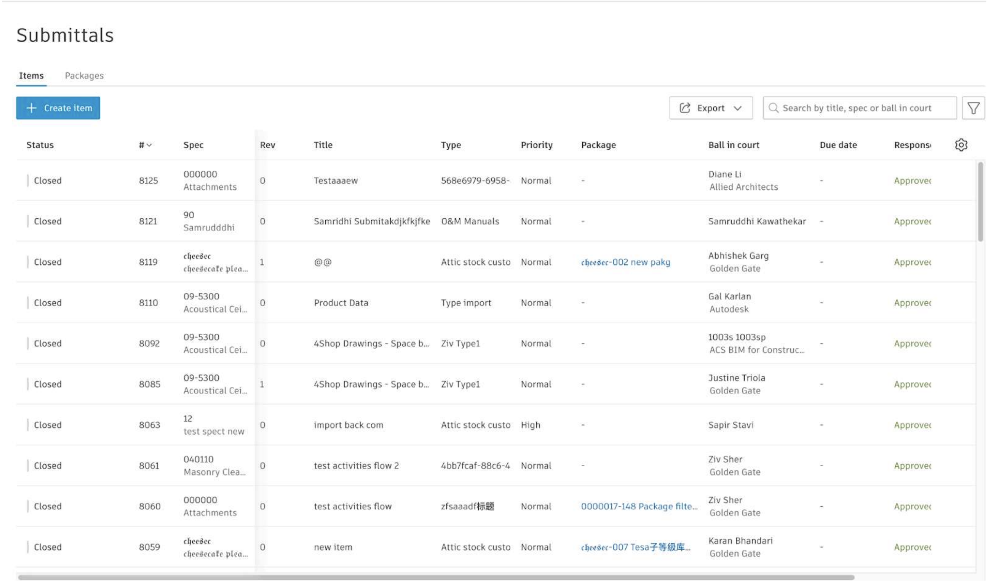
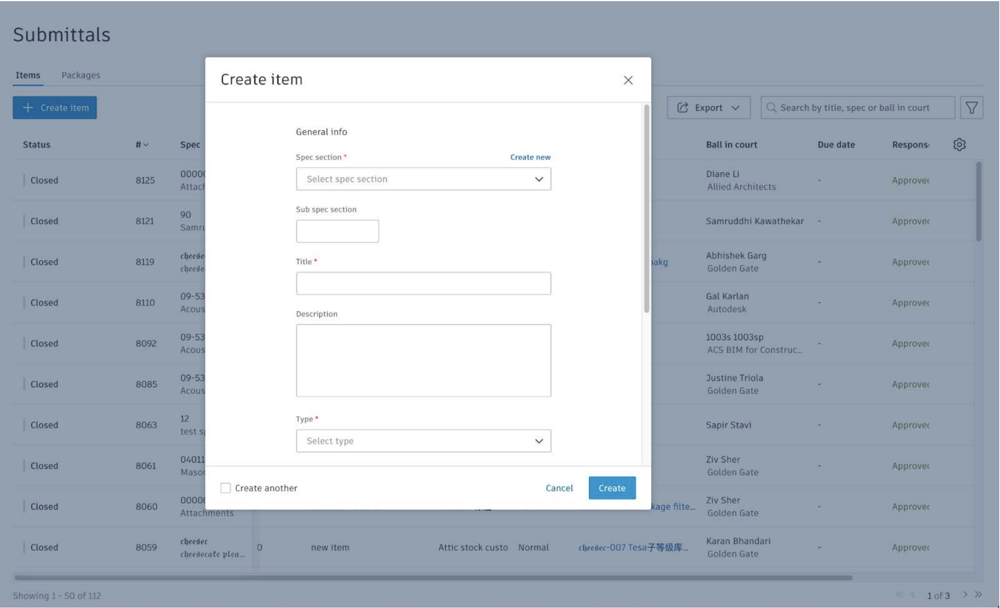
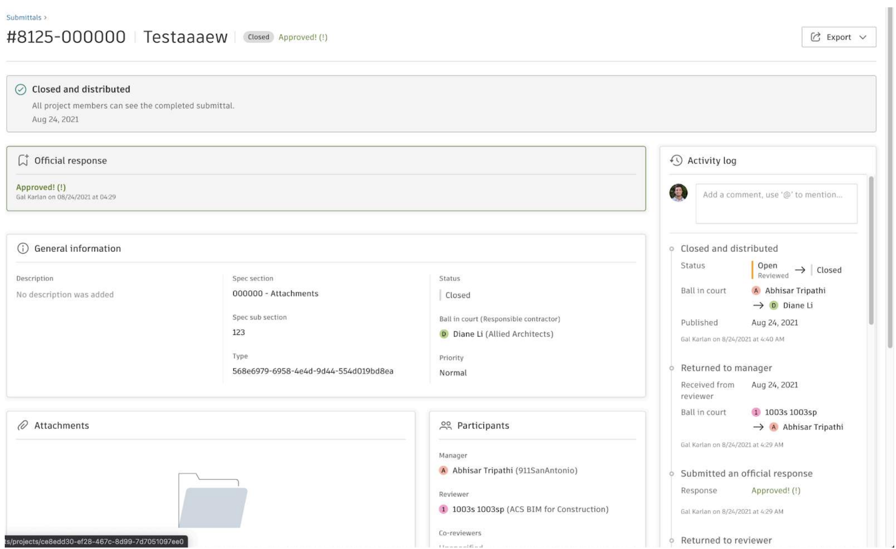

# Autodesk code challenge

A code challenge to demonstrate React and programming skills.

## Tech Stack

**Client:** React, React context, TailwindCSS, RadixUI

**API:** Retool

## Installation

Clone the project with git

```bash
  git clone https://github.com/pollencio/autodesk-code-challenge.git
  cd ./autodesk-code-challenge
```

Run the project with npm

```bash
  npm install
  npm run dev
```

## Demo


## Expected results

### Main page



### Modal



### Item page (optional)


